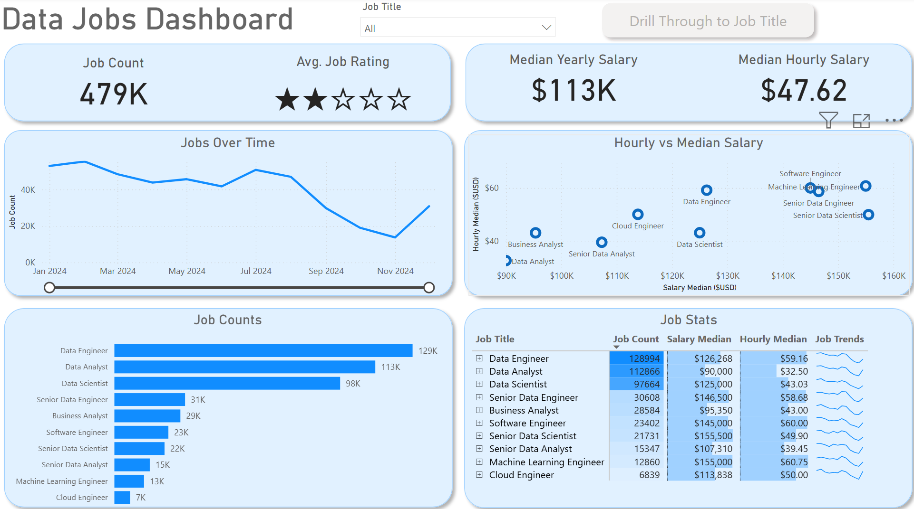
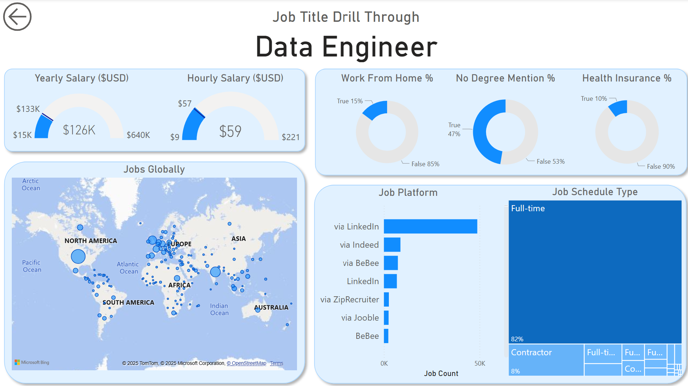

## Overview

This dashboard was built for **job seekers, career changers, and professionals** exploring new opportunities in data-related fields.

**It tackles a common problem:** information about data jobs is scattered and difficult to understand.

By bringing everything together in one place, this dashboard makes it easy to explore trends, salaries, and job locations in the data science job market.

What I Did 🚀
⚙️ Data Cleaning with Power Query

Cleaned and prepared data by addressing blanks, correcting data types, and creating new columns for enhanced analysis.

🧮 Key Measures

Calculated critical insights, including:
Median Yearly Salary: To understand salary trends.
Total Job Count: To quantify job opportunities.

📈 Charts Used

Incorporated various chart types for comprehensive trend analysis:
Column Charts: For comparing categorical data.
Bar Charts: For visualizing job counts and comparisons.
Line Charts: To display trends over time.
Area Charts: To highlight cumulative data patterns.

🗺️ Map Visualization

Utilized Map Charts to geographically represent job locations worldwide.

🔢 KPIs and Tables

Displayed key performance indicators using Cards for quick insights.
Included Tables for detailed data presentation, supporting sorting and filtering capabilities.

🎨 Dashboard Design

Designed a user-friendly and visually appealing dashboard:
Balanced common and creative chart types.
Ensured a clean and intuitive layout for ease of use.

🖱️ Interactivity

Enhanced user experience with interactive features:
Slicers: Enabled filtering by job title.
Buttons & Bookmarks: Facilitated seamless navigation between dashboard pages.
Drill-Through: Allowed users to navigate from high-level summaries to detailed job insights.

## Dashboard Overview

### Page 1: High-Level Market View

  

 It showcases key KPIs like total job count, median salaries, and top job titles to give you a quick understanding of what's happening in the job market at a glance.

### Page 2: Job Title Drill Through

   

This is the deep-dive page. From the main dashboard, you can drill through to this view to get specific details for a single job title, including salary ranges, work-from-home stats, top hiring platforms, and a global map of job locations.

## Conclusion

This Power BI dashboard turns raw job data into a vibrant, interactive tool for career planning. Slice, filter, and dive into the details to make confident, informed decisions about your next career move!
